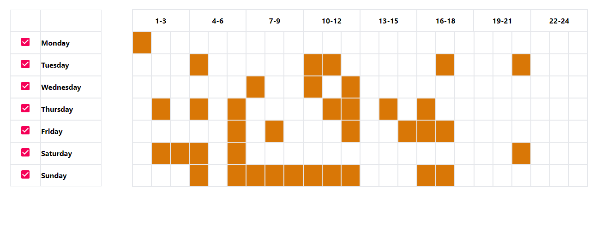

# Getting Started with Create React App

This project was bootstrapped with [Create React App](https://github.com/facebook/create-react-app).

It is using material UI and tailwind css for the designing.

# Get Started:
To install the dependencies:
npm install
To run the project:
npm start

# Design:

